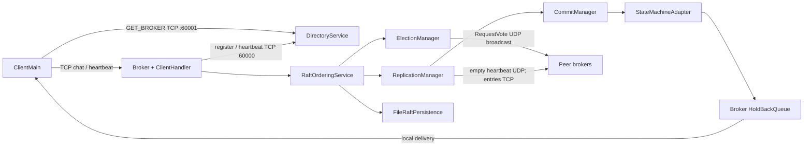
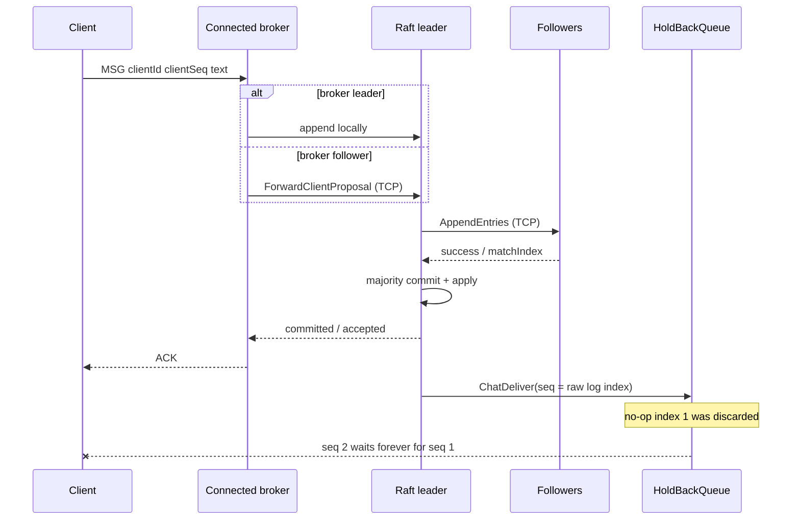

# Project Delivery Audit — storico, superato

Data audit: 2026-07-11  
Repository: `DS-Project2025-2026`  
Ambiente verificato: Windows 11 amd64, Oracle JDK 23.0.2, Apache Maven 3.9.15

> **DOCUMENTO STORICO.** Questo file conserva lo snapshot dell'audit del
> 2026-07-11 e non rappresenta priorita', scope o stato correnti. L'audit fresco del
> 2026-08-11 usa come unico tracker attivo
> [`docs/PRE_GROUP_MANUAL_TESTING_TODO.md`](docs/PRE_GROUP_MANUAL_TESTING_TODO.md),
> come baseline
> [`docs/PROJECT_SPECIFICATION.md`](docs/PROJECT_SPECIFICATION.md) e come allegato
> tecnico [`docs/CODE_ISSUES_BY_GROUP.md`](docs/CODE_ISSUES_BY_GROUP.md).
>
> Correzioni da applicare a tutto il testo storico sottostante:
>
> - la specifica ufficiale e i chiarimenti sono disponibili nel contesto di audit e
>   hanno precedenza sulle note interne;
> - `mvn test` esegue 186 test verdi, mentre 6 test JUnit 4 passano soltanto con
>   esecuzione diretta e non sono scoperti da Maven;
> - LAN broadcast e demo a due notebook **non** sono validate da test same-host;
> - crash-restart, torn-write, security e hardening production non sono requisiti
>   automatici e restano opzionali salvo claim esplicito;
> - il vecchio P0 sul solo timing del vector clock non e' confermato; il finding
>   causale concreto e' l'inversione FIFO durante retry/failover;
> - il finding sulla failure di persistenza del voto non dimostra una response non
>   durevole gia' esposta e non e' un P0 corrente;
> - i P0 software confermati sono il gap no-op/sequenza e la race atomica
>   role-term-append; il gate fisico a due notebook e' anch'esso P0 di consegna.
>
> Tabelle, checklist, claim “Complete” e remediation plan sotto questa nota sono
> quindi materiale storico, non backlog concorrente.

> **Verdetto: NOT READY – FUNDAMENTAL PROBLEMS**

## 1. Executive summary

Il repository implementa una chat distribuita Java composta da Directory Service, broker Raft e client TCP. I broker usano membership statica distribuita dalla Directory, `RequestVote` e heartbeat Raft vuoti su UDP broadcast, `AppendEntries` con payload e forwarding delle proposte su TCP, persistenza locale di term/voto/log/progresso di commit e vector clock più hold-back queue al livello applicativo.

Il core Raft contiene diverse scelte tecnicamente corrette: quorum derivato da un voter set immutabile, voto persistito prima della risposta, controllo di freschezza del log, conflict hints, commit su maggioranza solo per entry del term corrente, no-op all'elezione e scritture persistenti con fsync/rename atomico. La suite JUnit 5 è ampia sul core: `mvn clean verify` esegue 186 test verdi, ripetuti cinque volte senza failure.

Il sistema, tuttavia, **non realizza la funzionalità centrale end-to-end**. Ogni nuovo leader appende una no-op. L'adapter applicativo scarta la no-op ma usa l'indice grezzo del log come sequenza chat; la hold-back queue attende invece una sequenza densa a partire da 1. La prima chat ha quindi `seq=2` e resta bloccata per sempre in attesa di una `seq=1` che non verrà mai emessa. Il runbook reale con Directory, tre processi broker e due client ha riprodotto il fallimento due volte su due su tutti e tre i broker. I test chiamati “end-to-end” si fermano a `RaftOrderingService` e non attraversano `Broker`/`HoldBackQueue`, perciò non vedono il difetto.

Sono inoltre presenti rischi critici di recovery e semantica: lo stato applicativo non viene riallineato al `lastApplied` al restart; una tail parziale del log viene ignorata ma non troncata, rendendo non recuperabili gli append successivi; la deduplica al riavvio considera committate anche entry non committate e può produrre ACK falsi; durante un cambio leader lo stesso retry può essere appeso due volte. Nel percorso client normale heartbeat, messaggi, retry, JOIN e QUIT scrivono concorrentemente sul medesimo `ObjectOutputStream`, che non è thread-safe.

La consegna non è neppure autosufficiente: mancano README, wrapper Maven, launcher, CI, Docker/script, configurazione esterna e specifica ufficiale; il jar non è avviabile con `java -jar`. La documentazione interna ammette che failover/restart reali devono ancora essere validati ed è incoerente sul meccanismo di deduplica e sul numero di test.

### Punti di forza

- separazione esplicita tra API di ordering, election, replication, commit, transport e persistence;
- membership statica e quorum coerente;
- buone invarianti Raft di base e numerosi test unitari deterministici;
- persistenza di term/voto prima di rendere osservabile il voto;
- log matching, conflict hints e current-term commit rule presenti;
- trasporto ibrido coerente con la motivazione progettuale;
- identità client migliorata a `(clientId, clientSeq)`.

### Rischi principali

- chat di produzione mai consegnata dopo la prima elezione;
- recovery applicativo e del file log non sicuri;
- deduplica capace di perdere o duplicare messaggi;
- corruzione possibile dello stream client nel normale funzionamento;
- failover client e Directory non affidabili;
- test verdi che non coprono il percorso realmente eseguito;
- progetto non portabile né avviabile da un valutatore senza ricostruire manualmente il runbook.

## 2. Confidence level

**Confidenza: alta** sul verdetto.

Sono stati verificati dinamicamente:

- build pulita, package, dependency tree e compatibilità con `--release 16`;
- 186 test JUnit 5, più cinque ripetizioni complete;
- esclusione silenziosa di 6 test JUnit 4 e loro esecuzione diretta con `JUnitCore`;
- startup reale di Directory + tre `BrokerMain` + due `ClientMain`;
- elezione di un leader e fallimento deterministico della prima chat, ripetuto 2/2;
- comportamento della hold-back queue con `seq=2`;
- recovery dopo tail parziale del log, che fallisce al restart successivo;
- assenza del `Main-Class` nel jar.

Sono state valutate staticamente, con controesempi e analisi degli interleaving:

- network partition e perdita della maggioranza;
- crash nei singoli punti di persistenza;
- risposta Raft fuori ordine o con term superiore;
- race Directory/reaper e riconnessione client;
- slow client, exhaustion di thread e input ostili;
- deployment su più host LAN.

Non sono stati eseguiti un vero test multi-host, una partition reale, un kill/restart dopo avere corretto il blocker, né test di carico. Tali limiti non riducono il verdetto: la funzionalità centrale fallisce già nel runbook locale documentato.

La specifica ufficiale dell'insegnamento non è presente. `docs/PROJECT_SPECIFICATION.md` è una design note del team che ricostruisce i requisiti; è stata usata come fonte principale disponibile, ma la conformità alla consegna ufficiale resta parzialmente **Unverified**.

## 3. Architecture overview

### 3.1 Componenti e responsabilità reali

| Componente | Responsabilità effettiva | Note |
|---|---|---|
| `DirectoryService` | topologia statica, registrazione/liveness broker, scelta broker per client | SPOF per startup broker e reconnect; non partecipa al consenso |
| `BrokerMain` | recupera voter set, costruisce config e avvia un broker | Directory fissata a `localhost:60000` |
| `Broker` | sessioni locali, vector clock, cache richieste, callback Raft, broadcast ai client | networking, delivery e causalità sono fortemente accoppiati |
| `ClientHandler` | una sessione TCP, parsing, proposta, ACK, heartbeat | un thread per connessione |
| `ClientMain` | query Directory, JOIN, input, retry, heartbeat e reconnect | più writer concorrenti sullo stesso stream |
| `RaftOrderingService` | compone core, persistence, transport, proposal/dedup e apply | è il production path |
| `RaftNode` | term, voto, ruolo, leader noto | stato sincronizzato e term/voto persistiti |
| `RaftElectionManager` | timer, election, voti, heartbeat schedule | alcuni higher-term path non convergono correttamente |
| `RaftReplicationManager` | append, conflict repair, next/match index e commit | I/O applicativo può avvenire sotto il suo lock |
| `RaftCommitManager` | commitIndex, lastApplied e apply ordinato | apply sincrono nel thread Raft |
| `FileRaftPersistence` | `state.bin`, `commit.bin` e `log.bin` | tail parziale non riparata |
| `RaftRpcClient/Server` | RPC TCP one-shot | cached pool non limitati, Java serialization |
| `RaftUdpBroadcastTransport` | vote request e heartbeat vuoti | UDP comune al cluster |
| `LanDiscoveryService/PeerRegistry` | discovery ausiliaria | non integrata nel consenso e, di fatto, non scopre peer con porte diverse |



### 3.2 Startup effettivo

1. `DirectoryService` riceve un `votersCSV` e apre listener fissi 60000/60001.
2. `BrokerMain` contatta obbligatoriamente `localhost:60000`, recupera i voter e crea `raft-data/n{id}`.
3. `RaftOrderingService.start` carica term/voto/log/progresso, crea server TCP e UDP, replication ed election.
4. Il broker si registra nella Directory **prima** di aprire il socket client, esegue discovery e solo dopo ascolta i client.
5. Il client interroga la Directory, apre TCP verso il broker, invia JOIN e avvia sender, receiver e heartbeat.

### 3.3 Publish/consume effettivo



Il leader appende il comando e attende fino a 5 secondi il commit. Il follower inoltra sincronicamente al leader. Dopo maggioranza, ogni nodo applica l'entry; l'adapter converte il log index in `ChatDeliver.seq`. Il broker dovrebbe passare il messaggio alla hold-back queue e poi ai client locali, ma il gap introdotto dalle no-op impedisce il rilascio.

### 3.4 Crash, recovery e shutdown

- Un nodo riparte come follower con term/voto/log/commit progress persistiti.
- Non viene riallineato lo stato volatile `HoldBackQueue`/vector clock con `lastApplied`.
- Il follower catch-up usa conflict hints e TCP, ma può consegnare entry antecedenti alla connessione a client appena collegati.
- Il client rileva il broker tramite heartbeat; al primo errore di reconnect esce dal tentativo e non programma ulteriori retry.
- Directory e broker non hanno API/shutdown hook di chiusura ordinata; il main broker resta in `accept()` infinito.

## 4. Requirements traceability matrix

| Requisito ricostruito | Implementazione | File/classi | Test | Stato | Note |
|---|---|---|---|---|---|
| Client connesso a qualunque broker | Directory + forwarding follower | `DirectoryService`, `Broker`, `RaftOrderingService` | solo service-level | Partial | connessione funziona, delivery no |
| Stesso ordine globale | Raft log index + hold-back | `RaftStateMachineAdapter`, `HoldBackQueue` | nessun E2E applicativo | **Incorrect** | no-op crea gap permanente |
| Causal order | vector clock + hold-back | `VectorClock`, `Broker`, `HoldBackQueue` | unit test parziali | **Incorrect** | clock aggiornato dopo I/O e non per tutti i ready |
| Elezione leader a maggioranza | Raft election | `RaftNode`, `RaftElectionManager` | ampia suite unit/in-process | Partial | higher-term response e timer race |
| Un voto per term, durevole | persistenza term/voto | `RaftNode`, `FileRaftPersistence` | sì | Partial | corretto con storage sano; failure I/O non rende il nodo fail-stop |
| Log matching/conflict repair | prev index/term + hints | `RaftLog`, `RaftReplicationManager` | sì | Complete | core statico corretto nelle condizioni testate |
| Commit solo su maggioranza | match index + current-term rule | `RaftCommitManager` | sì | Complete | vale per il core; apply applicativo può fallire |
| Minoranza non committa | quorum statico | `RaftConfig`, `RaftCommitManager` | non con partition reale | Unverified | dedotto corretto dal calcolo quorum |
| Follower catch-up/divergenza | nextIndex, conflict term/index | `RaftReplicationManager` | unit/in-process | Partial | response fuori ordine regredisce nextIndex |
| Crash/restart broker | file persistence | `FileRaftPersistence`, `RaftOrderingService` | solo ordering service | **Incorrect** | stato applicativo non sincronizzato; tail corrotta |
| Retry senza duplicati | `clientId/clientSeq` + set dedup | `Broker`, `RaftOrderingService` | happy path | **Incorrect** | falsi ACK e duplicati su failover |
| ACK dopo commit | `propose` sincrona | `ClientHandler`, `RaftOrderingService` | parziale | Partial | normalmente sì; dedup non committata restituisce true |
| Nessuna history offline | nessun consumer store | `Broker`/callback apply | nessun test | Partial | catch-up può essere inviato a client nuovi |
| Reconnect dopo crash broker | heartbeat + Directory | `ClientMain`, `ClientHeartbeatManager` | nessun test | **Incorrect** | un solo tentativo; Directory stale |
| Failure di link/ritardi | timeout Raft; heartbeat client | transport/client | nessuna failure injection completa | Partial | write client senza timeout; HOL |
| LAN broadcast | UDP votes/heartbeat | `RaftUdpBroadcastTransport` | in-process | Complete | assunzione LAN; niente fallback |
| Membership statica | voter map immutabile | `RaftConfig` | sì | Complete | coerente con design |
| Dynamic membership | assente per scelta | n/a | n/a | Missing | dichiarata fuori scope |
| Network partition | nessun supporto dichiarato | quorum Raft | nessun test | Unverified | safety plausibile, liveness solo con maggioranza |
| Build riproducibile e avvio esterno | Maven + runbook docs | `pom.xml`, `docs` | build locale | Partial | jar non avviabile; no README/wrapper/script |
| Sicurezza input/network | Java serialization non filtrata | tutti gli endpoint | nessun test | **Incorrect** | DoS e impersonation banali |
| Specifica ufficiale tracciabile | non presente | design notes interne | n/a | Unverified | serve allegare la consegna ufficiale |

## 5. What is done well

1. **Membership e quorum:** `RaftConfig.java:102-127,181-190` valida una mappa non vuota, coerenza chiave/id e la copia in forma immutabile; il quorum deriva esclusivamente dal voter set statico.
2. **Term e voto durevoli:** `RaftNode.java:108-114,146-164,223-253` persiste self-vote, reset del voto su term superiore e voto concesso prima di restituire la response.
3. **Vote freshness:** `RaftNode.java:270-282` applica correttamente il confronto lessicografico `lastLogTerm`/`lastLogIndex`.
4. **Log matching:** `RaftLog.java:189-243` controlla `prevLogIndex/prevLogTerm`, rileva conflitti, tronca e aggiunge solo il suffisso necessario.
5. **Protezione del prefisso committato:** `RaftLog.java:245-280` rifiuta esplicitamente di troncare indici entro il commit index.
6. **Commit rule Raft:** `RaftCommitManager.java:124-152` usa majority order statistic e impedisce al leader di avanzare direttamente su entry di term precedenti.
7. **Applicazione ordinata:** `RaftCommitManager.java:155-171` applica senza gap tra `lastApplied+1` e `commitIndex` e persiste il progresso.
8. **No-op di nuovo term:** `RaftOrderingService.java:150-157` implementa la tecnica corretta per rendere committabile il prefisso precedente; il bug è nell'integrazione della sequenza applicativa, non nell'idea Raft.
9. **Conflict optimization:** `RaftReplicationManager.java:117-149,183-204` produce e usa `conflictTerm/conflictIndex` per il catch-up.
10. **Persistenza di base:** `FileRaftPersistence.java:92-189,193-227` usa temp file, fsync, atomic move e best-effort fsync della directory per metadata e truncation.
11. **Separazione trasporti:** `RaftHybridTransport.java:65-88` invia vote/heartbeat broadcast via UDP e payload via TCP, in coerenza con la motivazione documentata.
12. **Filtro broadcast:** `RaftUdpBroadcastTransport.java:230-246` filtra cluster, self, target e sender non voter e deduplica i message id.
13. **Identità client:** `Broker.java:430-447` e `RaftOrderingService.java:427-438` usano una chiave tecnica `clientId/clientSeq` anziché lo username.
14. **Regressioni Raft:** i test coprono election retry, vote safety, conflict repair, commit term rule, persistenza, forwarding e trasporto ibrido; 186 test Jupiter sono passati cinque volte.

## 6. Complete findings

I finding sono ordinati per severità e poi per area. Le osservazioni puramente cosmetiche sono escluse.

### BLOCKER

#### DS-BLOCKER-001 — Le no-op Raft bloccano ogni chat nel percorso di produzione

- **Categoria/file/metodo:** ordering/application integration; `RaftOrderingService.onLeaderElected` (`RaftOrderingService.java:150-157`), `RaftStateMachineAdapter.accept` (`RaftStateMachineAdapter.java:27-40`), `HoldBackQueue.releaseReadyMessages` (`HoldBackQueue.java:34-48,85-110`), `Broker.handleOrderedMessage` (`Broker.java:370-391`).
- **Descrizione e scenario:** alla prima elezione viene appesa correttamente una no-op all'indice 1. L'adapter la scarta, ma assegna alla prima chat il raw log index 2. La queue parte da `expectedSeq=1` e richiede uguaglianza; l'indice 1 non arriverà mai come `ChatDeliverMessage`. Ogni successiva elezione introduce un altro buco.
- **Impatto:** il comando può essere committato e il producer può ricevere ACK, ma nessun client riceve la chat. La coda cresce senza limite.
- **Prova:** runbook reale Directory + 3 broker + 2 client, ripetuto 2/2: `BobReceived=false` e su tutti i broker `Gap detected! Received seq = 2, expected = 1`. Probe JShell: `ready=0, expected=1, pending=1` per una delivery con seq 2.
- **Fix:** introdurre una sequenza applicativa densa e deterministica, oppure notificare al broker ogni indice applicato incluse no-op/config entries; in alternativa eliminare la seconda sequenziazione e sfruttare l'apply Raft già ordinato.
- **Test obbligatorio:** cluster reale attraverso `Broker` e `HoldBackQueue`; una chat dopo ogni elezione deve raggiungere tutti i destinatari.

### CRITICAL

#### DS-CRITICAL-001 — Race di leadership può creare due comandi diversi allo stesso index/term

- **Categoria/file/metodo:** Raft safety/concorrenza; `RaftReplicationManager.appendCommandAsLeader` (`RaftReplicationManager.java:86-92`), `RaftElectionManager.onRequestVoteRequest` (`RaftElectionManager.java:281-316`), `RaftNode.handleRequestVote` (`RaftNode.java:223-253`), `RaftLog.appendEntries` (`RaftLog.java:211-225`).
- **Interleaving:** L è leader nel term T e supera il check di ruolo; una `RequestVote(T+1)`, protetta da un lock diverso, lo rende follower; L riprende, legge il nuovo term T+1 e appende `x` pur non essendo leader. Il vero leader T+1 appende `y` allo stesso indice. Poiché il follower confronta soltanto il term, considera `x` e `y` uguali.
- **Impatto:** due state machine possono applicare comandi diversi allo stesso index/term: violazione diretta di Log Matching e State Machine Safety. La stessa race può far emettere heartbeat con term nuovo ma leaderId del vecchio leader (`RaftReplicationManager.java:235-249,285-298`).
- **Motivo:** ruolo e term non vengono letti/validati come uno snapshot atomico; election e replication non sono serializzati da un unico event loop/lock.
- **Fix:** un'unica serializzazione delle transizioni Raft (event loop è preferibile) oppure token `(role,term,generation)` atomico verificato immediatamente prima e dopo l'append/send.
- **Test:** latch deterministico tra role-check e term-read; forzare step-down e provare che nessuna entry/heartbeat venga prodotta dalla vecchia leadership.

#### DS-CRITICAL-002 — Il restart non ricostruisce la state machine applicativa

- **Categoria/file/metodo:** recovery/causalità; `RaftOrderingService.start` (`RaftOrderingService.java:95-115`), costruttore `RaftCommitManager` (`RaftCommitManager.java:61-75`), `Broker` (`Broker.java:60-63,109-147`), `HoldBackQueue.syncToSequence` (`HoldBackQueue.java:168-188`).
- **Scenario:** prima del crash `commitIndex=lastApplied=N`. Il nuovo `Broker` crea queue e clock vuoti; il commit manager riparte da `lastApplied=N` e non rigioca 1..N. La nuova chat N+1 resta dietro `expectedSeq=1`; le dipendenze vector-clock pre-crash risultano zero.
- **Evidenza:** `onBrokerIdAssigned` è definito ma non viene mai invocato; il latch viene aperto già nel costruttore (`Broker.java:109-115`). Anche quella callback sincronizzerebbe solo la sequenza, non il delivered clock.
- **Impatto:** perdita permanente di liveness e causal state dopo un restart, requisito esplicitamente dichiarato in scope.
- **Fix:** replay silenzioso dell'intero prefisso committed prima di aprire la porta client, oppure snapshot durevole completo della state machine applicativa.
- **Test:** commit, crash/recreate del vero `Broker` sullo stesso storage, nuovo commit e dipendenza causale; nessun gap o history impropria.

#### DS-CRITICAL-003 — Tail WAL parziale non riparata avvelena gli append futuri

- **Categoria/file/metodo:** durability/recovery; `FileRaftPersistence.appendLogEntry` (`FileRaftPersistence.java:177-190`) e `loadLogEntries` (`FileRaftPersistence.java:230-256`).
- **Scenario:** un crash lascia length/payload parziale. Il primo load ignora la tail ma non tronca `log.bin`. I nuovi record vengono fsyncati dopo quei byte; al restart seguente il reader si ferma/deserializza sulla vecchia tail e non raggiunge i record validi.
- **Prova dinamica:** dopo tail parziale, primo recovery = 1 entry; append della seconda; secondo recovery = `RaftPersistenceException: Failed to deserialize log entry`.
- **Impatto:** un follower può ACKare entry apparentemente durevoli, contribuire a un commit di maggioranza e perderle/non ripartire al crash successivo; rischio di durability e disponibilità, potenzialmente safety.
- **Fix:** scansione con offset dell'ultimo record valido, truncate+force prima di riaprire agli append; aggiungere magic, versione, checksum e max record size.
- **Test:** tail parziale → recovery → append → secondo recovery deve restituire tutti i record validi.

#### DS-CRITICAL-004 — La deduplica tratta come committed l'intero log persistito

- **Categoria/file/metodo:** dedup/recovery; `RaftOrderingService.start` (`RaftOrderingService.java:95-107`) e `appendAndWaitForCommit` (`RaftOrderingService.java:269-283`).
- **Scenario:** un leader persiste K ma cade prima del quorum. Al restart K entra in `committedProposalKeys` benché `commitIndex` sia precedente; il retry restituisce immediatamente `true` a `:274-277` senza nuova replica/commit.
- **Impatto:** ACK definitivo per un messaggio mai committato e successivamente sovrascrivibile: perdita dati.
- **Fix:** popolare il set committed solo dal prefisso `1..restoredCommitIndex`; separare “present in log”, “pending” e “committed”.
- **Test:** log con K e `commitIndex=0`; il retry non deve avere esito positivo prima del quorum.

#### DS-CRITICAL-005 — Un retry durante failover può essere appeso e consegnato due volte

- **Categoria/file/metodo:** idempotenza/leader change; `RaftOrderingService.appendAndWaitForCommit` (`RaftOrderingService.java:269-316`), `completePendingCommit` (`RaftOrderingService.java:406-420`), leader no-op (`:150-156`).
- **Scenario:** K è replicata sul futuro leader ma non ancora committed. `committedProposalKeys` viene aggiornato soltanto all'apply; subito dopo l'elezione e prima che la no-op committi il prefisso, il retry K non viene riconosciuto e viene appeso una seconda volta. Il commit della no-op/prefisso può poi applicare entrambe.
- **Impatto:** doppia delivery e violazione della semantica di retry dichiarata.
- **Fix:** indicizzare anche le client key non committed presenti nel log e associare key→index/term; al nuovo leader ricostruire pending log keys prima di accettare proposte.
- **Test:** entry K replicata ma non committed, crash leader, elezione del follower, retry prima del primo heartbeat; una sola K nel log/apply.

#### DS-CRITICAL-006 — Failure di persistence può rendere osservabile un voto non durevole

- **Categoria/file/metodo:** Raft election safety; `RaftNode.handleRequestVote` (`RaftNode.java:223-253`), `becomeFollower` (`:146-164`), `FileRaftPersistence.persistTermAndVote` (`FileRaftPersistence.java:93-116`).
- **Scenario:** il nodo persiste `(T,null)` entrando nel term, poi assegna in memoria `votedFor=C` e la persistenza del voto fallisce. Il worker non risponde ma il nodo resta attivo. Una richiesta duplicata di C trova `voteChanged=false`, salta la persistence e riceve grant. Dopo crash il disco contiene `(T,null)` e il nodo può votare D nello stesso term.
- **Impatto:** lo stesso voto può aiutare due candidati nel medesimo term: violazione di Election Safety.
- **Motivo:** un errore stable-storage non porta il processo Raft in stato fail-stop/unhealthy e lo stato in memoria resta pubblicabile.
- **Fix/test:** qualsiasi failure di persistence Raft deve arrestare definitivamente il nodo o eseguire rollback dimostrabilmente sicuro; fake persistence che fallisce solo sul voto, poi duplicato e restart.

### HIGH

#### DS-HIGH-001 — Writer concorrenti sullo stesso ObjectOutputStream client

- **File/metodi:** `ClientMain.java:69-94,139-198`; `ClientMessageSender.java:66-84,138-159`; `ClientHeartbeatManager.java:82-90`.
- **Scenario/impatto:** heartbeat, invio, retry, JOIN e QUIT eseguono `writeObject` contemporaneamente sullo stesso stream non thread-safe, producendo corruzione, disconnessioni o retry intermittenti nel normale utilizzo.
- **Fix/test:** singolo writer con coda bounded o lock/session writer comune; test con stream rallentato e writer concorrenti, poi deserializzazione completa.

#### DS-HIGH-002 — Higher-term RequestVoteResponse ignorata fuori dallo stato candidate

- **File/metodo:** `RaftElectionManager.onRequestVoteResponse`, `RaftElectionManager.java:400-425`.
- **Scenario:** una response T+1 arriva in ritardo quando il nodo è appena leader/follower; `:411-413` ritorna prima del check del term a `:415-422`.
- **Impatto:** il nodo non converge immediatamente al term superiore e può continuare a presentarsi come leader stale.
- **Fix/test:** processare sempre un term superiore prima del role gate; response ritardata T+1 a neo-leader deve causare step-down e persistenza.

#### DS-HIGH-003 — Step-down da AppendEntriesResponse non riattiva l'election timeout

- **File/metodi:** `RaftReplicationManager.handleAppendEntriesResponse` (`RaftReplicationManager.java:160-171`), `RaftElectionManager` (`RaftElectionManager.java:460-475,534-539`).
- **Scenario:** il leader vede una response T+1, aggiorna `RaftNode` e pulisce replication, ma non notifica l'election manager. Quest'ultimo aveva cancellato il timeout da leader; il task heartbeat ora è inerte.
- **Impatto:** follower senza election timeout finché non arriva un altro evento; perdita di liveness se il nodo T+1 scompare/non diventa leader.
- **Fix/test:** transizione higher-term centralizzata che ferma heartbeat e arma sempre un timeout follower.

#### DS-HIGH-004 — Response AppendEntries concorrenti possono regredire nextIndex

- **File/metodi:** `RaftReplicationManager.java:183-210`, `RaftPeerReplicationState.java:34-50`, invii async `RaftRpcClient.java:162-175`.
- **Scenario:** più RPC per follower sono in flight. Una success response vecchia aggiorna `matchIndex` in modo monotono ma imposta `nextIndex=response.match+1` incondizionatamente; una failure vecchia può anch'essa farlo scendere sotto `matchIndex+1`.
- **Impatto:** resend massivi, catch-up che oscilla e possibile starvation sotto reorder/ritardo.
- **Fix/test:** request generation/prevIndex per peer, una RPC in flight o ignore di response obsolete; preservare `nextIndex >= matchIndex+1`.

#### DS-HIGH-005 — I/O verso client sotto lock e nel percorso di apply Raft

- **File/metodi:** `Broker.onChatDeliver` (`Broker.java:324-331`), `ClientHandler.sendLine` (`ClientHandler.java:62-71`), `RaftCommitManager.java:90-97,161-175`.
- **Scenario:** un client che non legge blocca `writeObject` mentre il broker detiene il lock globale `clients`; il callback è sincrono nel commit/apply.
- **Impatto:** blocco degli altri client, di AppendEntries/commit, delle future producer e possibili elezioni spurie.
- **Fix/test:** outbound queue bounded per client e apply non bloccante; slow consumer non deve fermare un client sano né il quorum.

#### DS-HIGH-006 — Failover client one-shot contro Directory ancora stale

- **File/metodi:** `ClientHeartbeatManager.java:17-20,80-123`, `ClientMain.java:142-177`, reaper `DirectoryService.java:26-27,329-347`.
- **Scenario:** il client sospetta il crash verso 9–10 s; il reaper usa `>10 s` e gira ogni 5 s, quindi può rimuovere a ~15 s. Il client riceve il broker morto, fallisce l'unica `open()` e non riavvia heartbeat/retry.
- **Impatto:** reconnect automatico definitivamente fallito in uno scenario ordinario.
- **Fix/test:** retry continuo con backoff/jitter e invalidazione immediata/lease generation nella Directory.

#### DS-HIGH-007 — I broker non si ri-registrano dopo errore o restart della Directory

- **File/metodi:** `Broker.connectAndRegisterWithDirectoryService/startHeartbeatLoop` (`Broker.java:455-517`), mappe volatili `DirectoryService.java:30-37`.
- **Scenario:** connessione iniziale fallita, link rotto o Directory riavviata. Registrazione/heartbeat non vengono ricreati; la nuova Directory è vuota.
- **Impatto:** cluster Raft vivo ma invisibile ai nuovi/reconnecting client fino al restart di tutti i broker.
- **Fix/test:** state machine di registrazione con reconnect/backoff; riavviare solo la Directory e attendere il ritorno di `GetBroker`.

#### DS-HIGH-008 — Race e phantom endpoint nel registro Directory

- **File/metodi:** `DirectoryService.registerBroker/reaper` (`DirectoryService.java:283-315,329-343`), `BrokerConfig.equals/hashCode` (`BrokerConfig.java:64-79`).
- **Scenari:** (a) reaper legge timestamp vecchio, arriva heartbeat nuovo, poi `remove(id)` cancella il broker vivo; (b) stesso ID riparte con endpoint diverso, lasciando due chiavi `BrokerConfig`, di cui quella vecchia può restare selezionabile per sempre.
- **Impatto:** broker vivo escluso o client instradati indefinitamente a endpoint morto.
- **Fix/test:** unico `Map<Integer,BrokerRecord>` con session generation e rimozione condizionale atomica; test con latch e doppia registrazione.

#### DS-HIGH-009 — Java deserialization non filtrata su endpoint esposti

- **File:** `ClientHandler.java:81-87`, `DirectoryService.java:136-149,191-224`, `RaftRpcServer.java:124-143`, `RaftUdpBroadcastTransport.java:402-409`.
- **Scenario/impatto:** l'object graph viene costruito prima dell'`instanceof`. Un input remoto può causare allocation/depth DoS e, se disponibili gadget, code execution.
- **Fix/test:** protocollo framed/schema esplicito; almeno `ObjectInputFilter` allowlist con limiti bytes/depth/references/array; inviare graph ostili e verificarne il rifiuto bounded.

#### DS-HIGH-010 — Identità client/broker/Raft non autenticate né vincolate alla sessione

- **File/metodi:** `ClientHandler.java:108-126`, `DirectoryService.java:202-220,264-315`, `RaftRpcServer.java:146-155`, `RaftUdpBroadcastTransport.java:230-289`, `RaftElectionManager.java:400-438`.
- **Scenario:** dopo JOIN come A una sessione invia `MSG B ...`; un processo aggiorna count/registrazione di un altro broker; RPC TCP non voter o UDP con sender/payload incoerenti alterano term/log. Le vote response contano `response.voterId` senza membership check nel manager.
- **Impatto:** furto chiavi dedup, directory hijack, step-down/log injection e quorum falsificabile sotto spoofing. L'assenza di Byzantine behavior non giustifica l'esposizione dei client Internet senza boundary.
- **Fix/test:** identità fissata dopo JOIN, allowlist voter e coerenza source/envelope/payload, TLS/mTLS o MAC di cluster; casi impersonation devono essere rifiutati.

#### DS-HIGH-011 — Thread/socket illimitati e slowloris

- **File:** `Broker.java:260-275`, `DirectoryService.java:94-124`, `RaftRpcServer.java:76-81,111-143`, `RaftRpcClient.java:96-100,162-175`.
- **Scenario/impatto:** connessioni che non inviano header occupano un thread per socket; RPC usa cached pool illimitati e i server non hanno read timeout. Possibile esaurimento thread, descriptor e heap.
- **Fix/test:** executor bounded, timeout handshake/read, limiti globali/per-IP e chiusura socket attive; slowloris massivo con soglie verificate.

#### DS-HIGH-012 — Catch-up monolitico più timeout corto può non convergere

- **File/metodi:** `RaftReplicationManager.java:235-298`, `RaftRpcClient.java:44-46,170-191`, `FileRaftPersistence.java:177-190`.
- **Scenario:** il leader copia/invia tutto il suffisso; il follower fsynca ogni entry. Se supera il read timeout di 1 s, la response viene scartata e il suffisso viene reinviato al tick successivo.
- **Impatto:** amplification rete/CPU/disco, molti task in flight e follower necessario al quorum incapace di risultare caught-up.
- **Fix/test:** batch per numero/byte, una pipeline per peer e timeout configurabile; follower arretrato di migliaia di entry con persistence lenta deve convergere.

#### DS-HIGH-013 — Lifecycle start/stop non transazionale e mutazioni post-stop

- **File/metodi:** `RaftOrderingService.java:211-254`, `RaftHybridTransport.java:54-63`, `RaftRpcServer.java:84-100,124-143`, inbound manager methods.
- **Scenario:** server TCP avviato e bind UDP fallito: `running` non è ancora true e `stop()` non effettua rollback. Handler già accettati possono continuare dopo stop perché vote/append inbound non verificano una generation corrente.
- **Impatto:** porte/executor leaked, restart impossibile e due istanze che mutano lo stesso storage.
- **Fix/test:** startup con rollback `try/finally`, lifecycle state esplicito e generation token; bind UDP fallito e handler sospeso durante stop.

#### DS-HIGH-014 — Il broker viene pubblicizzato prima del bind della porta client

- **File/metodo:** `Broker.start`, `Broker.java:238-276`.
- **Scenario:** il broker avvia Raft, si registra e fa tre announce con sleep; soltanto dopo crea il `ServerSocket` client. Durante la finestra la Directory restituisce un endpoint non pronto; se la porta è occupata rimane stale fino al reaper.
- **Impatto:** connection refused in startup normale e failure parziale.
- **Fix/test:** bind client prima della registrazione readiness e rollback completo; con porta occupata il broker non deve comparire nella Directory.

#### DS-HIGH-015 — Configurazione hardcoded impedisce un deployment LAN reale

- **File:** `BrokerMain.java:32-34,119-150`, `Broker.java:39-43,455-458`, `DirectoryService.java:45-47`.
- **Scenario:** ogni broker su un host diverso tenta la propria `localhost:60000`; host/porta Directory non sono argomenti né environment/config. Anche i due listener Directory sono fissi.
- **Impatto:** la topologia descritta “broker sulla stessa LAN” non è distribuibile su più macchine senza modificare il codice. Directory è anche SPOF per startup/restart di voter.
- **Fix/test:** config/CLI validata per tutti gli endpoint, multi-host test o container network; documentare availability assumptions.

#### DS-HIGH-016 — Delivery callback fallita viene marcata comunque applied

- **File/metodi:** `RaftOrderingService.notifyDelivery` (`RaftOrderingService.java:388-396`) e `RaftCommitManager.applyCommittedEntries` (`RaftCommitManager.java:161-175`).
- **Scenario:** la callback applicativa lancia; `notifyDelivery` cattura e non propaga, quindi il commit manager incrementa/persiste `lastApplied`.
- **Impatto:** quel broker perde definitivamente la delivery e continua con le successive, divergendo dall'output osservato dagli altri.
- **Fix/test:** state machine apply transazionale/idempotente, errore fatale o retry persistito prima di avanzare `lastApplied`; callback failing-once deve essere riprovata.

#### DS-HIGH-017 — Clock causale aggiornato dopo l'I/O e incompleto nei rilasci multipli

- **File/metodo:** `Broker.handleOrderedMessage`, `Broker.java:370-391`; `HoldBackQueue.java:104-111`.
- **Scenario:** la queue rilascia uno o più messaggi, il broker prima li invia ai client e soltanto dopo fonde il clock del solo `chatDeliver` che ha innescato il rilascio. Un client può rispondere durante l'I/O; se una seq mancante libera più entry, i clock delle altre non entrano nel send clock.
- **Impatto:** la nuova proposta può omettere una dipendenza appena osservata, violando la garanzia causale dichiarata.
- **Fix/test:** fondere in ordine il clock di ogni ready **prima** di qualsiasi I/O/callback; client che risponde immediatamente e rilascio batch.

#### DS-HIGH-018 — Catch-up può violare il “no history for disconnected clients”

- **File/flusso:** `Broker.start/handleOrderedMessage` (`Broker.java:238-276,370-391`), apply follower `RaftReplicationManager.java:111-149`.
- **Scenario:** un follower riparte/è arretrato, apre la porta client prima di aver completato il catch-up; un client nuovo si collega e riceve entry committate prima della sua connessione quando vengono applicate.
- **Impatto:** contraddice `PROJECT_SPECIFICATION.md:89-100,148-157` e l'interpretazione “nessuna history offline”.
- **Fix/test:** readiness solo dopo initial catch-up oppure watermark di connessione per handler; messaggi antecedenti al JOIN non devono essere inviati.

#### DS-HIGH-019 — Future di proposta orfane bloccano tutti i retry successivi

- **File/metodi:** `RaftOrderingService.java:269-326`, truncation hook `RaftOrderingService.java:117-123`.
- **Scenario:** proposta appesa, timeout e successivo truncamento. L'hook rimuove solo la chiave committed; la future resta in `pendingCommits`. Ogni retry ritrova la future mai completabile e non appende.
- **Impatto:** perdita permanente di liveness per quella client key e leak.
- **Fix/test:** associare key/index e completare+rimuovere al truncate/leadership loss; append-timeout-truncate-retry deve poter committare.

#### DS-HIGH-020 — Sei test JUnit 4 sono esclusi e manca un E2E applicativo

- **File:** `pom.xml:19-37`; `VectorClockTest` (4), `VectorClockMultiBrokerIntegrationTest` (1), `integration/VectorClockIntegrationTest` (1); `RaftOrderingServiceIntegrationTest.java:31-44,65-113`.
- **Prove:** selezione Maven delle tre classi: `Tests run: 0`; esecuzione diretta `JUnitCore`: `OK (6 tests)`. I 186 eseguiti non avviano Directory/Broker/Client completi; il test chiamato end-to-end cattura direttamente callback Raft e non asserisce il primo seq.
- **Impatto:** suite verde con blocker centrale non osservato e falsa confidenza sulla causalità.
- **Fix/test:** migrare a Jupiter o Vintage; test Failsafe multi-processo che verifichi ACK e output di due client su broker distinti.

#### DS-HIGH-021 — Consegna non autosufficiente per un valutatore

- **File/repository:** nessun `README`, `mvnw/.mvn`, Dockerfile/Compose, script start/stop, CI, config esterna o esempio. Runbook unico in `docs/PRE_GROUP_MANUAL_TESTING_TODO.md:84-127`.
- **Problema:** il runbook salta i test, usa `target/classes`, non dichiara versioni, cleanup preciso, porte occupate o troubleshooting; `java -jar` fallisce perché manca `Main-Class`.
- **Impatto:** alto rischio di fallimento durante compilazione/demo del docente.
- **Fix/test:** README dalla clone alla demo, wrapper/toolchain, launcher o jar eseguibili, config sample, clean verify e smoke test su macchina pulita.

#### DS-HIGH-022 — FIFO client non garantito durante retry/reconnect

- **File/metodi:** pending `ConcurrentHashMap` in `ClientMessageSender.java:25,138-161`; riconnessione `ClientMain.java:153-170`.
- **Scenario:** seq 1 e 2 restano pending al crash. Dopo reconnect il retry itera `pendingMessages.values()` senza ordine e può inviare 2 prima di 1; il broker non valida né bufferizza `clientSeq` e può committarle in quell'ordine.
- **Impatto:** violazione FIFO/program order e quindi causalità per lo stesso client durante il failure scenario più importante.
- **Fix/test:** coda ordinata per seq, next-expected per client e dedup/ack cumulativo o selettivo; crash con due pending deve conservare ordine 1,2.

### MEDIUM

#### DS-MEDIUM-001 — Persistence senza limiti, checksum o versione

- **File:** `FileRaftPersistence.java:120-132,161-172,230-278`.
- **Problema/impatto:** length prefix enorme porta a `readNBytes(len)` e possibile OOM; bit rot non rilevato; nessun magic/schema/versione; `ATOMIC_MOVE` senza fallback.
- **Fix/test:** max record, CRC, header/versione, validazione index/term/progress; file con length `Integer.MAX_VALUE` deve fallire bounded.

#### DS-MEDIUM-002 — Stato, log e cache crescono senza bound/compaction

- **File:** `Broker.java:80-82,430-443`, `RaftOrderingService.java:56-61`, `ClientMessageSender.java:25`, `RaftLog.java:21`.
- **Impatto:** log, dedup keys, cached requests e pending client crescono per l'intera vita; una perdita di quorum amplifica il fenomeno.
- **Fix/test:** snapshot/compaction, retention dedup coerente, TTL/cap e backpressure; soak test con heap/disk stabili.

#### DS-MEDIUM-003 — Commit progress persiste più volte sul percorso critico

- **File:** `RaftCommitManager.java:90-97,161-175`, `FileRaftPersistence.java:137-158`.
- **Problema:** ogni entry applicata notifica/persiste, poi il caller notifica ancora al termine; tmp-write, rename e fsync duplicati si sommano al fsync dell'append.
- **Impatto:** throughput basso e timeout più probabili durante catch-up.
- **Fix/test:** eliminare notify duplicata e introdurre batching/group commit preservando durability.

#### DS-MEDIUM-004 — Object stream long-lived accumulano handle

- **File:** heartbeat/scritture in `Broker.java:489-497`, `ClientHeartbeatManager.java:85-90`, `ClientHandler.java:62-68`.
- **Impatto:** le handle table di Java serialization crescono su sessioni infinite, soprattutto con heartbeat ogni secondo.
- **Fix/test:** framing alternativo o `reset()` coordinato periodico; soak con heap retained-size.

#### DS-MEDIUM-005 — Discovery LAN presente ma incapace di scoprire peer

- **File:** `BrokerMain.java:87-93`, `LanDiscoveryService.java:49-66,142-182`.
- **Scenario:** nodo 0 ascolta/trasmette su 50002, nodo 1 su 50003, ecc.; ogni HELLO va solo alla porta del mittente.
- **Impatto:** `PeerRegistry` rimane vuoto. Non rompe il quorum perché la feature è dichiarata ausiliaria, ma è codice presente non funzionante.
- **Fix/test:** discovery port comune; due servizi devono comparire reciprocamente.

#### DS-MEDIUM-006 — Receiver UDP/discovery fragili a runtime exception

- **File:** `RaftUdpBroadcastTransport.java:209-227`, `LanDiscoveryService.java:49-60,85-136`.
- **Problema:** catch incompleti permettono a payload semanticamente invalidi/`NumberFormatException` di terminare l'unico listener; discovery imposta `running=true` prima del bind e non lo ripristina su failure.
- **Fix/test:** boundary catch+validazione per datagramma, supervisor e startup transazionale; un datagramma invalido non deve impedire il successivo valido.

#### DS-MEDIUM-007 — Cache dedup UDP O(N) per ogni pacchetto

- **File/metodo:** `RaftUdpBroadcastTransport.java:293-304`.
- **Impatto:** ogni datagramma scansiona tutta la cache; flood di UUID unici causa costo quadratico e memoria proporzionale al rate per 30 secondi.
- **Fix/test:** cache TTL bounded/eviction incrementale e rate limit.

#### DS-MEDIUM-008 — Eventi JOIN/LEAVE e stream osservati non sono globalmente coerenti

- **File:** `Broker.java:297-331,399-409`; `ClientHandler.java:91-94,108-116`.
- **Scenario:** sender escluso dalla chat committed; JOIN/LEAVE usano `nextSeq` locale separato da Raft e sono visibili solo sul broker locale.
- **Impatto:** client diversi osservano stream differenti e numeri collidenti, in tensione con la claim “stesso ordine” se comprende tutti i messaggi UI.
- **Fix/test:** distinguere protocollo eventi locali da chat globale e documentare/asserire la semantica; preferibile echo committed anche al sender.

#### DS-MEDIUM-009 — Parsing client ambiguo e payload senza limiti

- **File:** `ClientMessage.java:49-68`, `ClientJoinMessage.java:23-50`, `ClientAckMessages.java:5-22`, `ClientHandler.java:105-139`.
- **Problema:** `startsWith("MSG")`/`startsWith("ACK")`, JOIN ripetibile, messaggi prima del JOIN, nessun limite per username/id/text; errori runtime possono chiudere il solo handler.
- **Impatto:** comandi ambigui, spam e log/disk DoS.
- **Fix/test:** grammar esatta, state machine sessione e max byte UTF-8; casi `MSGX`, pre-JOIN, JOIN ripetuto e oversized.

#### DS-MEDIUM-010 — Heartbeat e retry client non sono robusti

- **File:** `ClientHeartbeatManager.java:70-73`, `ClientMessageReceiver.java:62-77`, `ClientMessageSender.java:138-169`.
- **Problema:** qualunque ACK vecchio azzera tutti i miss; pending è scansionato ogni 100 ms e ritrasmesso senza backoff/cap; nessuna persistenza.
- **Impatto:** failure detection falsata e amplification durante outage.
- **Fix/test:** correlazione monotona al broker/sessione, backoff+jitter, coda bounded e policy overflow.

#### DS-MEDIUM-011 — Configurazione runtime non validata coerentemente

- **File:** `BrokerMain.java:52-93` e voter endpoint da Directory.
- **Scenario:** `rpcPort` CLI può differire da `voters[nodeId].rpcPort`; il nodo ascolta sulla prima e i peer contattano la seconda. Errori numerici/CSV terminano con eccezioni non guidate; storage relativo riusa stato vecchio.
- **Impatto:** cluster non raggiungibile per una configurazione apparentemente accettata.
- **Fix/test:** schema config unico e validation cross-field/fail-fast con messaggio; casi mismatch/duplicate port/storage.

#### DS-MEDIUM-012 — Directory può rimanere viva a metà

- **File:** `DirectoryService.java:62-67,94-128`.
- **Scenario:** una delle porte fisse è occupata; quel thread listener termina ma l'altro thread non-daemon mantiene il processo attivo.
- **Impatto:** servizio apparentemente vivo ma incapace di registrare broker o servire client.
- **Fix/test:** bind di entrambe le socket prima della readiness; qualsiasi failure chiude tutto ed esce non-zero.

#### DS-MEDIUM-013 — Documentazione stale e contraddittoria

- **File:** `PROJECT_SPECIFICATION.md:189,195-200,224,233-275`; `PRE_GROUP_MANUAL_TESTING_TODO.md:40-51`; `CODE_ISSUES_BY_GROUP.md:164-170,279-286`.
- **Problema:** alcuni documenti dichiarano dedup `(username,timestamp)` futura, mentre il codice usa `(clientId,clientSeq)`; riportano 170 test anziché 186+6 esclusi e ammettono ancora demo/failover/restart da fare.
- **Impatto:** traceability e difesa orale inaffidabili.
- **Fix/test:** una sola specifica versionata, matrice requisiti e risultati generati dalla CI.

#### DS-MEDIUM-014 — Build Java fragile

- **File:** `pom.xml:15-17,40-94`.
- **Prova:** `source/target=16` su JDK 23 produce warning “system modules ... --release 16 is recommended”; con `-Dmaven.compiler.release=16` i 186 test passano.
- **Problema:** niente `release`, Enforcer/toolchain/wrapper; Java 16 non documentato. JUnit 4.13.1 è erroneamente `compile`. Surefire 2.22.1 ha inoltre scritto un dump con `Cannot use PPID ... Going to use NOOP events` su JDK 23; la suite è comunque terminata con successo.
- **Fix/test:** `maven.compiler.release`, JDK LTS/toolchain dichiarata, wrapper e dipendenze test-only.

#### DS-MEDIUM-015 — Stale election timeout può ancora scattare dopo cancel

- **File:** `DefaultRaftClock.java:28-38`, `RaftElectionManager.java:155-183,230-264`.
- **Scenario:** `cancel(false)` non ferma un callback già in esecuzione; non esiste generation token per distinguere il timeout sostituito da un heartbeat.
- **Impatto:** elezione spuria nonostante leader activity valida.
- **Fix/test:** generation/deadline token verificato nel callback; far scattare manualmente un task cancellato dopo reset.

#### DS-MEDIUM-016 — API/config presenti ma non integrate

- **Evidenze:** `OrderingServiceCallback.onBrokerIdAssigned/onConnectionEstablished/onConnectionLost` non sono chiamate; `GetPeerList*` non ha call site; `BrokerConfig.getClientPort` non è usato; `RaftPeerEndpoint.clientPort` non guida il listener; `ClientConnection` espone un `PrintWriter` sullo stesso stream di `ObjectOutputStream` (`ClientConnection.java:40-63`).
- **Impatto:** feature apparenti ma non operative e forte rischio di errori in future modifiche.
- **Fix/test:** rimuovere/deprecare oppure integrare con contract test; un solo framing per socket.

#### DS-MEDIUM-017 — Stato persistito non legato a cluster e membership

- **File/config:** `BrokerMain.java:58-83`, `RaftConfig.java:117-127`, layout `FileRaftPersistence.java:23-31`.
- **Scenario:** `raft-data/nX` viene riusata con clusterId, nodeId/endpoints o voter set diversi. Nessun cluster UUID/fingerprint membership è persistito e validato.
- **Impatto:** term/voto/log di un cluster possono contaminare un altro; un cambio membership manuale bypassa joint consensus.
- **Fix/test:** persistere e verificare `(clusterId,nodeId,voterSetHash/version)`; mismatch deve fallire chiaramente. I cambi reali richiedono joint consensus.

### LOW

#### DS-LOW-001 — Artefatto jar non riproducibile né direttamente avviabile

- `java -jar target/DS-Project2025-2026-1.0-SNAPSHOT.jar`: `no main manifest attribute`.
- Due clean package consecutivi hanno SHA-256 differenti; il manifest include `Built-By` e `Build-Jdk` e manca `project.build.outputTimestamp`.
- **Fix:** launcher/jar distinti per entry point o distribution; build reproducible se richiesta.

#### DS-LOW-002 — Igiene Git incompleta

- `.idea` e XML di migrazione Copilot sono tracciati nonostante `.gitignore`; `raft-data/` e `directory-raft-data/` non sono ignorati.
- Il worktree di audit conteneva una modifica preesistente, solo la parentesi del commento a `DirectoryService.java:62`; nessun segreto/path utente è emerso dalla scansione euristica.
- **Fix:** ignore e rimozione controllata dei metadata; consegna da checkout pulito, mantenendo separati i dati Raft.

#### DS-LOW-003 — Logging operativo insufficiente

- Uso diffuso di `System.out/err`, eccezioni talvolta ignorate e nessun livello, timestamp, correlation id o metriche.
- **Impatto:** diagnosi difficile di leader churn, retry, follower lag e leak durante la demo.
- **Fix:** logging strutturato minimo e metriche per role/term/commit/match/reconnect; non è sufficiente da solo a bloccare la consegna.

#### DS-LOW-004 — API pubblica recordVoteFor non persiste

- `RaftNode.recordVoteFor` (`RaftNode.java:194-200`) modifica soltanto memoria. Oggi ha call site solo nei test, quindi non è raggiungibile dal production path, ma viola il contratto implicito di `votedFor`.
- **Fix:** rimuoverla/ridurne la visibilità come helper test oppure applicare la stessa persist-before-publish.

## 7. Distributed systems correctness

### 7.1 Assunzioni effettive

Il sistema funziona, quando non incontra i bug sopra, soltanto sotto queste assunzioni:

1. membership statica identica su tutti i nodi e ID univoci;
2. storage directory privata per nodo, filesystem con atomic move e fsync sufficienti;
3. nessun Byzantine/spoofing e payload serializzati compatibili;
4. UDP IPv4 broadcast disponibile sulla LAN e porta comune libera/condivisibile;
5. Directory raggiungibile su localhost per ogni broker, quindi di fatto demo single-host;
6. maggioranza di voter raggiungibile per il commit;
7. callback client veloci e socket non bloccanti abbastanza da non superare i timeout;
8. nessun crash nei punti che lasciano una tail parziale non riparata;
9. nessuna risposta RPC reorder tale da far oscillare continuamente nextIndex;
10. processo appena avviato senza stato applicativo da riallineare.

Le assunzioni 7–10 non sono ragionevoli per un sistema distribuito e sono precisamente i failure scenario richiesti dalla consegna.

### 7.2 Valutazione proprietà Raft

| Proprietà | Stato | Evidenza/limite |
|---|---|---|
| Follower/candidate/leader | Partial | ruoli presenti; race role/term non atomica può appendere da follower |
| currentTerm persistito | Correct con storage sano | `RaftNode` persiste su election/higher term |
| votedFor persistito | Partial | persist-before-response nominale; failure I/O non è fail-stop |
| Un voto per term | Partial | `canVoteFor` corretto; DS-CRITICAL-006 consente doppio voto dopo failure/restart |
| Election timeout randomizzato | Correct | range inclusivo con `ThreadLocalRandom` |
| Reset timeout su leader activity | Partial | path principali presenti; higher-term append response non rearma |
| Heartbeat | Partial | schedulato; race può emetterlo con term/leadership incoerenti |
| RequestVote freshness | Correct | confronto term poi index |
| Maggioranza elezione | Correct | self-vote + set dedup votanti, sotto identità onesta |
| Higher-term step-down | **Incorrect** | vote response fuori ruolo ignorata; append response non completa transizione lifecycle |
| Log matching | **Incorrect complessivo** | algoritmo term/index corretto, ma race può creare stesso index/term con payload diverso |
| prevLogIndex/prevLogTerm | Correct | match esplicito |
| Conflict repair | Correct | truncate + conflict term/index |
| nextIndex/matchIndex | Partial | match monotono, next può regredire su response obsolete |
| commitIndex | Correct nel path nominale | majority e current-term rule |
| lastApplied/apply ordinato | Correct nel core | application state non ripristinata e callback failure marcata applied |
| Commit entry di term precedenti | Correct nel path nominale | no-op presente e current-term gate |
| Minoranza non committa | Unverified dinamicamente | dedotto dal quorum; nessun partition test reale |
| Reintegro follower | Partial | conflict hints presenti; batch/timeout/tail persistence possono impedirlo |
| Log divergente | Partial | repair nominale; same term/different command race invalida l'assunzione |
| Crash/restart | **Incorrect** | HBQ/clock, dedup e WAL tail |
| Dedup richieste client | **Incorrect** | false positive da tail uncommitted e doppio append failover |
| Due leader term diversi | Partial | quorum nominale protegge il commit, ma higher-term/race sono errati |
| Snapshot/log compaction | Missing | dichiarata non implementata; crescita illimitata |

### 7.3 Ordering, consistenza e semantica osservata

| Garanzia | Garanzia reale |
|---|---|
| Total order del log committed | presente nel core nominale, non difendibile dopo DS-CRITICAL-001 |
| Total order visto dai client | assente: DS-BLOCKER-001 impedisce ogni chat; eventi locali differiscono |
| FIFO per client | nominale sulla singola connessione; violato da retry unordered dopo reconnect |
| FIFO per broker | non garantito: build della request e `propose` non sono una sezione atomica tra handler |
| Causal order | il log unico aiuta nel path nominale, ma metadata/update e reconnect FIFO sono incompleti |
| At-most-once | non garantito: doppio append su failover |
| At-least-once | non garantito: reconnect one-shot, client crash e pending solo in memoria |
| Exactly-once | non garantito e correttamente non dichiarato come pieno; la dedup attuale è errata |
| Producer confirmation | normalmente dopo commit; falso positivo per entry non committed al restart |
| Consumer ACK/offset | assenti |
| Offline replay | non progettato, ma catch-up può accidentalmente esporre history a client nuovi |
| Persistenza messaggi | log Raft tecnico, senza compaction/snapshot e con recovery tail difettoso |

### 7.4 Controesempi sintetici

1. **Prima chat:** elezione → no-op index 1 scartata → chat index 2 → HBQ aspetta 1 per sempre.
2. **Safety same-term:** vecchio leader supera role-check → RequestVote T+1 lo rende follower → appende x in T+1 → vero leader appende y stesso index/T+1 → follower non sostituisce x perché il term coincide.
3. **ACK falso:** K persistita ma non committed → restart → K inserita nel set committed → retry riceve true → K viene poi sovrascritta.
4. **Duplicato failover:** K non committed sul futuro leader → elezione → retry prima del commit no-op → seconda K appesa → entrambe applicate.
5. **WAL:** tail parziale → recovery apparentemente riuscito → append nuovi record dopo tail → restart non li legge.
6. **FIFO retry:** pending {1,2} → CHM itera 2,1 → log committa 2,1.
7. **Causal clock:** seq mancante libera A e B → callback invia A/B → client risponde prima del merge → nuova proposta non include tutto lo stato osservato.
8. **Reconnect:** broker muore → client consulta Directory prima del reaper → endpoint morto → unica open fallisce → nessun nuovo tentativo.
9. **Slow client:** receive window piena → apply scrive sotto lock → AppendEntries response/commit bloccati → timeout/churn.

### 7.5 Failure scenarios richiesti

| Scenario | Atteso | Effettivo dedotto/osservato | Safety / liveness | Fix prioritario |
|---|---|---|---|---|
| Crash leader | nuova election, retry una volta | election core plausibile; client può non reconnect; dedup può duplicare | safety e liveness a rischio | DS-CRITICAL-005, HIGH-006 |
| Crash follower | maggioranza continua | leader continua; task RPC crescono; client di quel broker fragile | safety nominale, liveness parziale | batch/bounds/reconnect |
| Crash di più nodi | nessun commit senza quorum | `propose` timeout; pending/cache continuano | safety nominale, liveness persa | backpressure e test partition |
| Perdita maggioranza | niente ACK/commit | timeout 5 s; retry indefiniti, log/cache possono crescere | safety non testata, no liveness | partition test e bounded state |
| Riavvio nodo | recovery + catch-up | HBQ/clock non ripristinati; WAL/dedup errati | entrambe a rischio | CRITICAL-002/003/004 |
| Follower molto arretrato | batch progressivo | intero suffisso, fsync per entry, timeout/reinvio | liveness a rischio | HIGH-012 |
| Log divergente | conflict repair | nominalmente corretto; race same-term può renderlo irriparabile | safety a rischio | CRITICAL-001 |
| Leader isolato | non committa; maggioranza elegge | quorum lo limita nominalmente; client attendono timeout | safety non provata; client liveness bassa | test partition reale |
| Elezioni simultanee | split vote e retry random | coperto unitariamente | nominalmente corretto | test processo/partition |
| Perdita heartbeat | nuova election | timeout presenti; path higher-term può lasciare follower senza timer | liveness a rischio | HIGH-003 |
| Messaggi duplicati | dedup idempotente | due failure mode producono false positive o duplicati | safety applicativa violata | CRITICAL-004/005 |
| Messaggi fuori ordine | Raft/queue riordina | RPC nextIndex oscilla; client retry può invertire FIFO | liveness/semantica | HIGH-004/022 |
| Ritardi elevati | retry senza corruzione | molti RPC in flight; slow client blocca apply | liveness a rischio | HIGH-005/012 |
| Client disconnect durante request | retry dopo reconnect | pending in memoria; reconnect può fermarsi | at-least-once assente | HIGH-006 |
| Broker termina durante publish | nuovo leader deduplica | ACK perso può causare doppio append | semantica violata | CRITICAL-005 |
| Crash prima/dopo persistence | record atomico o repair | metadata buoni; log tail non riparata | durability a rischio | CRITICAL-003 |
| Crash prima/dopo response client | retry idempotente | ACK falso/doppio log possibili | perdita/duplicato | CRITICAL-004/005 |
| Config errata | fail-fast chiaro | hardcode/mismatch accettati o stack trace | liveness | HIGH-015, MEDIUM-011 |
| Porta occupata | nessuna readiness parziale | Directory/broker possono restare registrati/a metà | liveness/operabilità | HIGH-014, MEDIUM-012 |
| Directory/file mancanti | create o errore guidato | storage creato; Directory assente blocca/sgancia senza retry | liveness | HIGH-007/015 |
| Endpoint errato | errore config | nessuna cross-validation CLI/voter | liveness | MEDIUM-011 |
| Shutdown con operazioni | drain/stop ordinato | broker/directory senza stop; handler Raft post-stop | stato/ripartenza a rischio | HIGH-013 |

## 8. Test and execution results

### 8.1 Ambiente e risultati

| Voce | Valore |
|---|---|
| OS | Windows 11 amd64 |
| Java | Oracle JDK 23.0.2 |
| Maven | Apache Maven 3.9.15 |
| Sorgenti compilati | 75 main, 26 test source |
| Working tree iniziale | una modifica cosmetica preesistente a `DirectoryService.java:62` |

| Comando eseguito | Risultato |
|---|---|
| `mvn -B -ntp clean verify` | **SUCCESS**; 186 run, 0 failure, 0 error, 0 skip; Maven 20.483 s, wall 23.4 s |
| `mvn -q test` ripetuto 5 volte | tutti exit 0; 7.70, 12.02, 12.82, 9.65, 8.42 s |
| `mvn -B -ntp '-Dtest=VectorClockTest,VectorClockMultiBrokerIntegrationTest,VectorClockIntegrationTest' test` | **FAILURE**, `Tests run: 0` |
| `JUnitCore` sulle 3 classi JUnit 4 | `OK (6 tests)` |
| `mvn --% clean compile -Dmaven.compiler.showWarnings=true -Dmaven.compiler.compilerArgument=-Xlint:all` | SUCCESS con warning `--release 16` |
| `mvn --% clean verify -Dmaven.compiler.release=16` | SUCCESS; 186/0/0/0 |
| `mvn dependency:tree -Dverbose` | JUnit 5 test; JUnit 4.13.1 + Hamcrest transitivo in scope compile |
| `mvn -q clean package -DskipTests`, due volte | SUCCESS, ma SHA-256 differenti |
| `java -jar target\DS-Project2025-2026-1.0-SNAPSHOT.jar` | exit 1: `no main manifest attribute` |
| Runbook Directory + 3 broker + 2 client, due volte | startup/leader/client exit riusciti; chat cross-broker fallita 2/2 |
| Probe JShell HoldBackQueue seq 2 | `ready=0, expected=1, pending=1` |
| Probe JShell WAL tail→append→restart | primo recovery 1; secondo recovery `RaftPersistenceException` |

Hash dei due jar:

- `1B93C73F8CCFE3EB9E0A078A36DEC5298919CEF5546948C7710F3EAB1732A51A`
- `DC2CE9B9F8CB58F53819D7B3FF83DF33FFDB40987E7D6B1B6DD2C34E91F25D0F`

Warning significativo: Surefire 2.22.1 ha generato `target/surefire-reports/...-jvmRun1.dump` con `System.exit() or native command error interrupted process checker` e `Cannot use PPID ... Going to use NOOP events`. Non ha fatto fallire i test, ma conferma che la toolchain datata va aggiornata/validata sul JDK dichiarato.

### 8.2 Cosa coprono davvero i test

- 186 test Jupiter eseguiti; circa 167 sono Raft/protocollo e 19 application-unit.
- Election, term/voto, log conflict, commit rule, persistenza nominale, forwarding e trasporto ibrido hanno copertura sostanziale.
- `RaftOrderingServiceIntegrationTest` usa TCP/UDP e tre servizi nello stesso JVM, ma non crea `Broker`, Directory o client; il nome “end-to-end” è quindi fuorviante.
- `BrokerCausalDeliveryTest` costruisce manualmente sequenze 1,2,3 e non attraversa la no-op Raft.
- Il restart test chiama `stop()` pulito e verifica callback Raft, non process kill, power loss o state machine del broker.
- `FileRaftPersistenceTest.truncatedTailFromPartialAppendIsDroppedSilently` verifica solo il primo load, non l'append e il secondo restart.
- I test real-time usano polling/`Thread.sleep(50)` e porte “free then close”, con una piccola race, ma sono passati in cinque ripetizioni.
- Non esistono test reali per `DirectoryService`, `ClientMain`, `ClientConnection`, heartbeat, reconnect, shutdown, input ostile o multi-host.
- Sei test JUnit 4 sono compilati ma Maven non li scopre perché manca Vintage Engine.

### 8.3 Evidenza E2E

Seconda esecuzione:

```text
Message     : audit-repeat-...
AliceExit   : 0
BobExit     : 0
BobReceived : False
[Broker 0] Gap detected! Received seq = 2, expected = 1
[Broker 1] Gap detected! Received seq = 2, expected = 1
[Broker 2] Gap detected! Received seq = 2, expected = 1
```

I processi sono stati avviati in una directory temporanea, con classpath assoluto a `target/classes`, e terminati/bonificati in `finally`. Nessun listener è rimasto attivo.

### 8.4 Test mancanti concreti

| Test | Setup | Azione | Risultato atteso |
|---|---|---|---|
| First chat after no-op | 3 broker veri + 2 client | inviare una chat | ACK e una delivery su ogni destinatario, nessun gap |
| Post-failover no-op | cluster attivo | kill leader, nuova election, inviare | delivery continua nonostante nuova no-op |
| Leadership race | latch tra role-check/term-read | RequestVote T+1, poi resume append | nessuna entry dal vecchio leader |
| Vote persistence failure | persistence fallisce sul voto | duplicato C, crash, richiesta D | nessun doppio grant; nodo fail-stop |
| Tail repair | record valido + tail parziale | load, append, secondo load | tutti i record validi, file fisicamente troncato |
| Uncommitted dedup restart | K nel log, commit 0 | restart/election/retry | nessun true/ACK prima del quorum |
| Duplicate failover | K su follower non committed | promuovere e retry immediato | una sola K applicata |
| Broker recovery | N chat committed | process kill/restart, chat N+1 | queue/clock coerenti, N+1 consegnata |
| Higher-term delayed vote | neo-leader T | response vote T+1 | follower T+1 con timeout armato |
| Higher-term append response | leader T | response T+1 | election manager completa lo step-down |
| Response reorder | next/match con RPC concorrenti | success10, success5, failure2 | next resta almeno 11 |
| Lost ACK | commit K, drop response | retry via nuovo broker | una delivery e stesso risultato |
| FIFO reconnect | pending seq 1 e 2 | crash/reconnect | commit/delivery 1 poi 2 |
| Slow consumer | client A non legge, B sano | commit molte chat | B e Raft progrediscono entro deadline |
| Directory restart | broker vivi | restart solo Directory | broker si registrano di nuovo |
| Reaper race | clock/latch controllato | heartbeat tra scan/remove | broker vivo non rimosso |
| Endpoint replacement | stesso ID, endpoint B | scadere vecchia sessione | solo B o nessun stale endpoint |
| Minority partition | cluster diviso 1 contro 2 | propose su minoranza/maggioranza | nessun commit minoranza; maggioranza progredisce |
| Healing divergent log | partition + tail | riunire | prefisso committed identico, tail riparata |
| Follower 10k behind | persistence lenta | catch-up | batch bounded e convergenza |
| Stream writer race | writer/heartbeat con latch | invii concorrenti | stream sempre deserializzabile |
| Slowloris | molte socket mute | attendere timeout | risorse bounded e connessioni chiuse |
| Input/security | object graph/comandi invalidi | inviare payload ostili | rifiuto bounded, listener resta vivo |
| Port/config failure | porta occupata/mismatch RPC | startup | exit non-zero, nessuna readiness |
| History watermark | follower arretrato, client nuovo | catch-up | nessun messaggio pre-JOIN al client |
| Shutdown in-flight | handler sospeso | stop/restart | nessuna mutazione post-stop/leak |
| Multi-platform | Windows + Linux, JDK dichiarato | clean verify + smoke | stesso esito e runbook funzionante |

### 8.5 Limitazioni delle prove

- Il blocker ha impedito di dare valore a un test manuale successivo di leader crash/restart applicativo: prima va corretto e coperto.
- Non è stata creata una partition reale né usato un filesystem che non supporta atomic move.
- Nessun benchmark/soak o security exploit è stato eseguito.
- Nessun sorgente è stato modificato per “far passare” l'analisi; l'unica nuova modifica intenzionale è questo report.

### 8.6 Comandi E2E eseguiti

Lo script PowerShell della seconda esecuzione è riportato integralmente per riproducibilità; alcune istruzioni separate originariamente da punto e virgola sono soltanto state spezzate su più righe:

```powershell
$ErrorActionPreference='Stop'
$classes=(Resolve-Path 'target\classes').Path
$tempRoot=[IO.Path]::GetFullPath([IO.Path]::GetTempPath())
$tempDir=Join-Path $tempRoot ('ds-delivery-audit-repeat-' + [guid]::NewGuid().ToString('N'))
New-Item -ItemType Directory -Path $tempDir | Out-Null
$all=@()
function Start-JavaCaptured([string]$main,[string[]]$javaArgs,[bool]$input=$false){
 $psi=[Diagnostics.ProcessStartInfo]::new();$psi.FileName='java';$psi.WorkingDirectory=$tempDir
 $psi.UseShellExecute=$false;$psi.CreateNoWindow=$true
 $psi.RedirectStandardOutput=$true;$psi.RedirectStandardError=$true;$psi.RedirectStandardInput=$input
 $psi.ArgumentList.Add('-cp');$psi.ArgumentList.Add($classes);$psi.ArgumentList.Add($main)
 foreach($a in $javaArgs){$psi.ArgumentList.Add($a)}
 $p=[Diagnostics.Process]::new();$p.StartInfo=$psi
 if(-not $p.Start()){throw "start failed: $main"}
 $o=[PSCustomObject]@{Main=$main;Process=$p;OutTask=$p.StandardOutput.ReadToEndAsync();ErrTask=$p.StandardError.ReadToEndAsync()}
 $script:all+=$o;$o
}
try{
 $csv='0@127.0.0.1:7000:50000,1@127.0.0.1:7001:50001,2@127.0.0.1:7002:50002'
 $dir=Start-JavaCaptured 'it.polimi.ds.chat.directory.DirectoryService' @($csv)
 Start-Sleep -Milliseconds 700
 $b0=Start-JavaCaptured 'it.polimi.ds.chat.broker.core.BrokerMain' @('raft','0','7000','50000','7100','demo-cluster-repeat','1400')
 $b1=Start-JavaCaptured 'it.polimi.ds.chat.broker.core.BrokerMain' @('raft','1','7001','50001','7100','demo-cluster-repeat','1400')
 $b2=Start-JavaCaptured 'it.polimi.ds.chat.broker.core.BrokerMain' @('raft','2','7002','50002','7100','demo-cluster-repeat','1400')
 Start-Sleep -Seconds 3
 $bob=Start-JavaCaptured 'it.polimi.ds.chat.client.ClientMain' @('127.0.0.1','60001') $true
 $bob.Process.StandardInput.WriteLine('bob');$bob.Process.StandardInput.Flush()
 Start-Sleep -Milliseconds 900
 $alice=Start-JavaCaptured 'it.polimi.ds.chat.client.ClientMain' @('127.0.0.1','60001') $true
 $alice.Process.StandardInput.WriteLine('alice');$alice.Process.StandardInput.Flush()
 Start-Sleep -Milliseconds 900
 $message='audit-repeat-' + [guid]::NewGuid().ToString('N').Substring(0,8)
 $alice.Process.StandardInput.WriteLine($message);$alice.Process.StandardInput.Flush()
 Start-Sleep -Seconds 4
 $alice.Process.StandardInput.WriteLine('/quit');$bob.Process.StandardInput.WriteLine('/quit')
 $alice.Process.StandardInput.Close();$bob.Process.StandardInput.Close()
 $null=$alice.Process.WaitForExit(10000);$null=$bob.Process.WaitForExit(10000)
 $aliceOut=$alice.OutTask.Result;$bobOut=$bob.OutTask.Result
 [PSCustomObject]@{Message=$message;AliceExit=$alice.Process.ExitCode;BobExit=$bob.Process.ExitCode;BobReceived=$bobOut.Contains($message)} | Format-List
}
finally{
 foreach($o in $all){try{if(-not $o.Process.HasExited){$o.Process.Kill($true);$null=$o.Process.WaitForExit(5000)}}catch{}}
 '--- GAP/LEADER/PROPOSAL EVIDENCE ---'
 foreach($o in ($all|Where-Object{$_.Main -like '*BrokerMain'})){
  try{$s=$o.OutTask.Result+"`n"+$o.ErrTask.Result}catch{$s=''}
  ($s -split "`r?`n")|Where-Object{$_ -match 'Raft leader changed|Gap detected|Unexpected gap|Proposal rejected|cannot forward'}
 }
 $resolved=[IO.Path]::GetFullPath($tempDir)
 if(-not $resolved.StartsWith($tempRoot,[StringComparison]::OrdinalIgnoreCase)){throw "Unsafe cleanup $resolved"}
 if(Test-Path -LiteralPath $resolved){Remove-Item -LiteralPath $resolved -Recurse -Force}
}
```

Comando JUnit 4 diretto:

```powershell
$cp=@('target\test-classes','target\classes',"$env:USERPROFILE\.m2\repository\junit\junit\4.13.1\junit-4.13.1.jar","$env:USERPROFILE\.m2\repository\org\hamcrest\hamcrest-core\1.3\hamcrest-core-1.3.jar") -join ';'
java -cp $cp org.junit.runner.JUnitCore it.polimi.ds.chat.VectorClockTest it.polimi.ds.chat.VectorClockMultiBrokerIntegrationTest it.polimi.ds.chat.integration.VectorClockIntegrationTest
```

Output: `JUnit version 4.13.1`, sei punti, `OK (6 tests)` in 0.055 s.

## 9. Delivery risks

### Durante la compilazione del docente

- Nessun README/wrapper/toolchain: il valutatore deve indovinare Java/Maven.
- `source/target 16` su JDK moderno produce warning; Java 16 è una baseline non documentata.
- Sei test non vengono eseguiti da Maven pur essendo compilati.
- Il jar non ha entry point e non esistono launcher; il runbook dipende da `target/classes`.
- Directory e porte hardcoded possono collidere con processi locali.

### Durante la demo

- La prima chat non arriva: rischio certo e riprodotto, non intermittente.
- Il producer può vedere un ACK mentre il destinatario non vede nulla.
- Heartbeat e chat scrivono concorrentemente e possono corrompere lo stream.
- Il broker è annunciato prima di essere pronto e la discovery ausiliaria non trova peer.
- Log `System.out` rumorosi ma senza correlation rendono difficile spiegare il failure.

### Durante un test con crash

- Il client può consultare la Directory prima che il broker morto sia rimosso e non ritentare più.
- La Directory riavviata perde i broker e questi non si ri-registrano.
- Un failover nel punto giusto duplica una client key.
- Una failure stable-storage durante il voto non rende il nodo fail-stop.

### Durante un test concorrente

- Race role/term può violare la safety Raft.
- Response AppendEntries fuori ordine fanno regredire nextIndex.
- Slow client blocca apply/commit.
- Writer concorrenti corrompono ObjectOutputStream.
- Directory reaper può cancellare un heartbeat recente.

### Durante un restart

- HBQ e delivered vector clock ripartono vuoti mentre `lastApplied` resta avanzato.
- Una tail log parziale rende gli append successivi irrecuperabili.
- Entry non committed vengono marcate deduplicate/committed.
- Storage riusato con cluster diverso non viene rifiutato.

### Durante una network partition

- La minoranza non dovrebbe committare nel path nominale, ma manca una prova reale.
- Il leader isolato non usa check-quorum, continua ad appendere e accumulare pending/tail.
- Al healing, response reorder e dedup failover complicano la riconciliazione.
- Directory resta un failure domain esterno al consenso.

### Durante la lettura dettagliata del codice

- Il test “end-to-end” non attraversa l'applicazione.
- Callback e classi di discovery/peer list sono presenti ma non integrate.
- Documenti diversi raccontano dedup e stato test differenti.
- L'assenza della specifica ufficiale impedisce una traceability conclusiva.
- Metadata IDE tracciati e directory dati non ignorate danno un'impressione di repository non preparato.

## 10. Prioritized remediation plan

### Da correggere obbligatoriamente

| Priorità | Problema | Fix consigliato | File coinvolti | Complessità | Obbligatorio prima della consegna |
|---|---|---|---|---|---|
| P0.1 | DS-BLOCKER-001 no-op/HBQ | sequenza applicativa o apply marker per ogni log index | adapter, Broker, HBQ | M | **Sì** |
| P0.2 | DS-CRITICAL-001 race safety | singolo event loop/epoch atomico role+term+append | Node, Election, Replication, Log | L | **Sì** |
| P0.3 | DS-CRITICAL-006 vote persistence failure | nodo fail-stop su stable-storage error | Node, OrderingService, persistence | M | **Sì** |
| P0.4 | DS-CRITICAL-002 recovery state machine | replay/snapshot HBQ+clock prima readiness | OrderingService, Broker, HBQ | L | **Sì** |
| P0.5 | DS-CRITICAL-003 WAL tail | physical truncate+fsync e record validation | FileRaftPersistence | M | **Sì** |
| P0.6 | DS-CRITICAL-004/005 dedup | committed prefix corretto + pending keys/session table replicata | OrderingService, log/state machine | L | **Sì** |
| P0.7 | DS-HIGH-001 stream writer | writer unico/coda bounded per sessione | ClientMain, sender, heartbeat, connection | M | **Sì** |
| P0.8 | Test E2E regressivi | Failsafe multi-process Broker/Client/Directory | pom, nuovi test/scripts | M | **Sì** |
| P0.9 | Higher-term paths | transizione centralizzata e timeout follower | Election, Replication | M | **Sì** |
| P0.10 | Retry/reconnect FIFO | loop backoff, pending ordinato e stale broker handling | client, Directory | M | **Sì** |

### Fortemente consigliate

| Priorità | Problema | Fix consigliato | File coinvolti | Complessità | Obbligatorio prima della consegna |
|---|---|---|---|---|---|
| P1.1 | Slow client blocca Raft | outbound queues e apply non bloccante | Broker, ClientHandler | M | Sì per demo robusta |
| P1.2 | Lifecycle parziale | readiness, rollback e stop ordinato | Broker, Directory, Raft service | M | Sì |
| P1.3 | Directory SPOF/re-registration | lease record atomico e reconnect broker | Broker, Directory | M | Sì per crash demo |
| P1.4 | nextIndex response reorder | correlation/generation per RPC | Replication, RPC client | M | Sì per failure tests |
| P1.5 | Security/resource bounds | filter/codec, auth, pools/timeouts bounded | tutti gli endpoint | L | Sì almeno filtri/limiti |
| P1.6 | Catch-up bounded | AppendEntries batch e timeout config | Replication, transport | M | Fortemente |
| P1.7 | Causal/FIFO semantics | clock prima I/O, ordine pending, contract chiaro | Broker, client | M | Sì se requisito |
| P1.8 | JUnit 4 ignorati | migrazione Jupiter/Vintage, scope test | pom/tests | S | Sì |
| P1.9 | Runbook/autosufficienza | README, wrapper, config, launcher, CI | root/pom/docs | M | Sì |
| P1.10 | Multi-host config | rimuovere localhost/porte/storage hardcoded | main/config | M | Sì se LAN reale |

### Miglioramenti opzionali dopo la correttezza

| Priorità | Problema | Fix consigliato | File coinvolti | Complessità | Obbligatorio prima della consegna |
|---|---|---|---|---|---|
| P2.1 | Log/cache unbounded | snapshot, InstallSnapshot, retention | Raft/persistence | L | No per demo breve |
| P2.2 | Performance fsync | group commit e progress write singola | commit/persistence | M | No |
| P2.3 | Discovery ausiliaria | porta comune o rimozione feature | discovery/config | S | No se dichiarata inutilizzata |
| P2.4 | Build riproducibile | outputTimestamp/manifest stabile | pom | S | No |
| P2.5 | Logging/metriche | logger strutturato e metriche Raft | progetto | M | No |
| P2.6 | Cleanup codice morto | callback/API/config non usate | varie | S | No |

Ordine raccomandato: correggere prima il modello di sequenza/apply e introdurre l'E2E che oggi fallisce; poi rendere atomiche le transizioni Raft e sicuro il recovery; solo dopo correggere dedup/reconnect e validare crash/partition. Ottimizzare o ripulire prima di questi punti aumenterebbe il rischio senza rendere consegnabile il progetto.

## 11. Final delivery checklist

### Build e repository

- [x] `mvn clean verify` passa nell'ambiente di audit.
- [x] Cinque ripetizioni della suite Jupiter passano.
- [ ] Tutti i test presenti sono scoperti da Maven (6 JUnit 4 oggi esclusi).
- [ ] `maven.compiler.release`/toolchain e versione Java sono fissati.
- [ ] Maven Wrapper o prerequisiti riproducibili presenti.
- [ ] Jar/launcher avviabili per Directory, broker e client.
- [ ] README completo dalla clone alla demo.
- [ ] CI su almeno Windows/Linux.
- [ ] Working tree pulito e metadata/dati locali esclusi.
- [x] Nessun segreto evidente trovato con scansione euristica.
- [ ] Specifica ufficiale allegata e tracciata.

### Funzionalità

- [x] Directory e tre broker si avviano localmente.
- [x] Un leader viene eletto localmente.
- [ ] Prima chat consegnata end-to-end.
- [ ] Due client su broker diversi vedono lo stesso ordine.
- [ ] Sender/recipient semantics documentata e testata.
- [ ] FIFO client preservato durante reconnect.
- [ ] Causal order verificato end-to-end.
- [ ] Nessun duplicato su retry/ACK perso.
- [ ] ACK impossibile prima del commit reale.

### Failure e recovery

- [ ] Crash leader e nuova election con chat successiva.
- [ ] Crash follower senza perdita di quorum.
- [ ] Perdita maggioranza senza commit/ACK.
- [ ] Healing di log divergenti.
- [ ] Restart broker con HBQ/vector clock coerenti.
- [ ] Tail parziale riparata prima degli append.
- [ ] Failure persistence rende il nodo fail-stop.
- [ ] Restart Directory con broker auto-registrati.
- [ ] Client reconnect con retry/backoff a endpoint alternativo.
- [ ] Shutdown ordinato con operazioni in corso.

### Robustezza

- [ ] Writer unico per connessione client.
- [ ] Slow consumer non blocca Raft.
- [ ] Thread/socket/queue bounded e timeout presenti.
- [ ] Deserializzazione filtrata o sostituita.
- [ ] Identità client/peer verificate.
- [ ] Configurazione multi-host validata.
- [ ] Catch-up batchato e testato con follower molto arretrato.
- [ ] Storage vincolato a cluster/membership.

## 12. Final verdict

### **NOT READY – FUNDAMENTAL PROBLEMS**

Il progetto non è consegnabile nello stato attuale. La conclusione non deriva da standard qualitativi astratti: il runbook reale avvia correttamente cluster e client ma la prima chat resta bloccata su tutti i broker, due volte su due. Esistono inoltre un controesempio di State Machine Safety nella race role/term, recovery applicativo non ricostruito, WAL non riparata, doppio voto possibile dopo failure I/O e deduplica capace sia di perdere sia di duplicare messaggi.

**Blocker esatto:**

- **DS-BLOCKER-001:** no-op Raft scartata + raw log index + hold-back sequence densa ⇒ nessuna chat di produzione viene consegnata.

**Critical da trattare come condizioni obbligatorie, anche se non sono l'unico blocker osservabile immediato:**

- DS-CRITICAL-001: append/heartbeat non atomici rispetto allo step-down;
- DS-CRITICAL-002: state machine applicativa non ricostruita al restart;
- DS-CRITICAL-003: tail WAL parziale non troncata;
- DS-CRITICAL-004: tail non committed marcata committed per dedup;
- DS-CRITICAL-005: doppia entry della stessa client key al failover;
- DS-CRITICAL-006: voto non durevole pubblicabile dopo failure persistence.

### Condizioni minime per poter consegnare

1. Correggere DS-BLOCKER-001 senza rimuovere impropriamente la no-op Raft.
2. Aggiungere un E2E vero che fallisce oggi e che copra prima chat e post-failover.
3. Serializzare atomicamente ruolo, term, append e send Raft; chiudere tutti gli higher-term path.
4. Rendere recovery di WAL, HBQ/vector clock e dedup corretto e verificato con process kill.
5. Rendere il nodo fail-stop su errori stable-storage.
6. Eliminare le scritture concorrenti sullo stream client.
7. Verificare crash leader, restart follower, perdita maggioranza, ACK perso e healing.
8. Rendere visibili tutti i test e consegnare README/config/launcher riproducibili.

Finché queste condizioni non sono soddisfatte con evidenze automatiche e multi-processo, una demo semplice può mostrare election e commit nei log ma non dimostra una chat distribuita corretta.
